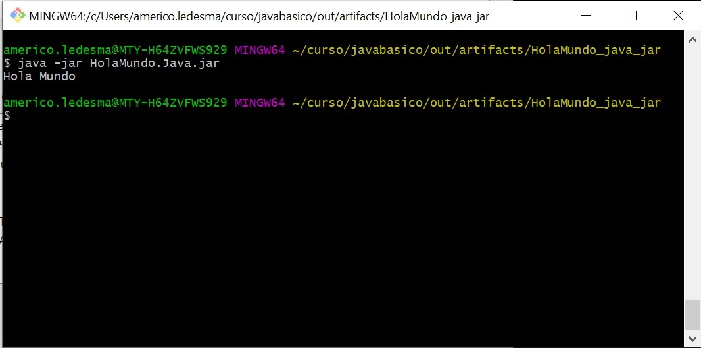
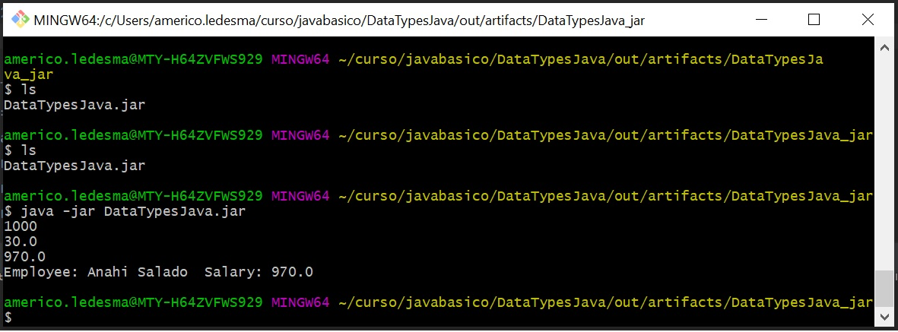
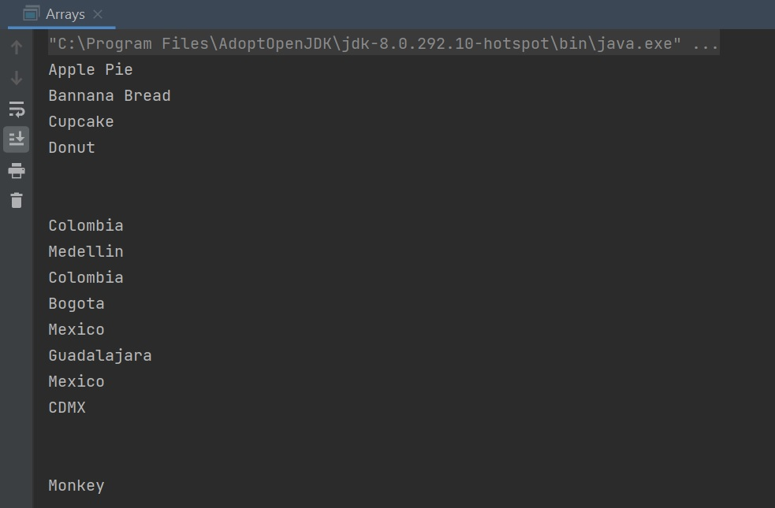

# Basic Java Course

##### Table of contents
* [Introduction](#introduction) 
* [Technologies](#technologies)
* [Commands](#commands)
* [Syntax](#syntax)
* [Illustrations](#illustrations)

## Introduction
Java was created in 1991 by James Gosling, is an high level language that uses the philosophy "write once run anywhere" (WORA).
This project is the result of a practice about basic commands used in java. 

## Technologies
* Java 8
* Java 11

## Commands:

| Function name | Description                    |
| ------------- | ------------------------------ |
| `Math.PI`      | Returns the PI value.       |
| `Math.ceil`   |  Rounds the specified double value upward and returns it    | 
| `Math.floor`   | Rounds the specified double value downward and returns it    | 
| `Math.pow`   |  Returns the result of the first argument raised to the power of second argument     | 
| `Math.sqrt`   |  Returns the square root of the specified number     | 
| `Math.min`   |  Returns the smaller value among the specified arguments    | 
| `Math.max`   |  Returns the maximum value among the specified arguments     | 

## Syntax
#### IF
```java
if(Expression1)
{
    variable = Expression2;
}
else
{
    variable = Expression3;
}
```
#### Ternary Operator (?:)
```java
variable = Expression1 ? Expression2: Expression3
```
Example
```java
num1 = 10;
num2 = 20;

res=(num1>num2) ? (num1+num2):(num1-num2)

Since num1<num2, 
the second operation is performed
res = num1-num2 = -10
```

### Arrays
```
// both are valid declarations
int intArray[]; 
or int[] intArray;

intArray = new int[20];  // allocating memory to array
```
In many cases assignment operator can be combined with other operators
* +=, for adding left operand with right operand and then assigning it to variable on the left.
* -=, for subtracting left operand with right operand and then assigning it to variable on the left.
* *=, for multiplying left operand with right operand and then assigning it to variable on the left.
* /=, for dividing left operand with right operand and then assigning it to variable on the left.
* %=, for assigning modulo of left operand with right operand and then assigning it to variable on the left.


## Illustrations
#### First "Hello World"
This was the JDK correct instalation test.


Then this is the first exacutable, that was a practice about the diferent kind of variables


This was the practice result about Arrays


